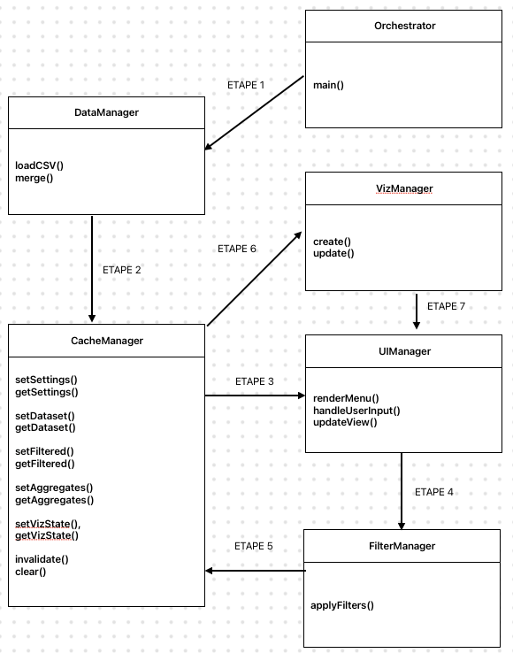
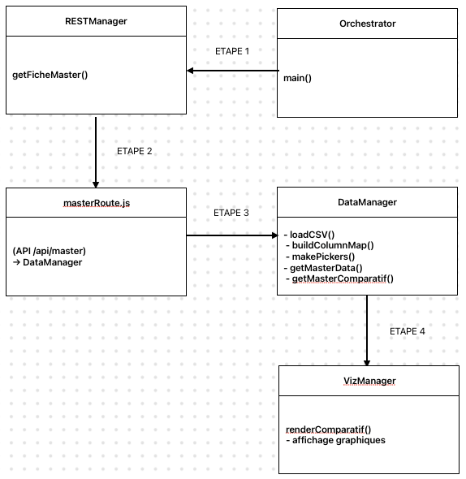

# SAE301-303

## commande a utiliser

### enregistrer vos modifications :

git add .

git commit -m "nom de la maj"

git push

### pour recuperer un fichier modifié par quelqu'un d'autre en meme temps :

git pull

### si les fichiers sont differents et que vous souhaitez les modifier :

git merge

### pour lancer le serveur

node serveur/index.js

## **Documentation technique (version claire et synthétique)**

### Objectif général

Présenter **une fiche descriptive de master** affichant un **comparatif 2023 <-> 2024** à partir des données MonMaster CSV.
Le projet repose sur une architecture modulaire claire : ****serveur (API)** +** **frontend (visualisation)**.

`CSV 2023 / 2024  →  DataManager.js  →  Routes API  →  Front JS Modules  →  Visualisation`

| Couche       | Fichier principal                                                      | Rôle                                                                   |
| ------------ | ---------------------------------------------------------------------- | ----------------------------------------------------------------------- |
| **Données** | `/data/fr-esr-mon_master_2023.csv`, `/data/fr-esr-mon_master_2024.csv` | Sources officielles MonMaster                                           |
| **Backend**  | `/serveur/DataManager.js`                                              | Lecture, mapping dynamique des CSV, calculs 2023 <-> 2024              |
|              | `/serveur/routes/masterRoute.js`                                       | Routes`/api/master/:id` (comparatif) et `/api/master/:id/:annee` (mono) |
|              | `/serveur/routes/searchRoute.js                                        | Recherche d’ID, liste complète (mode outils) (utilisation perso) |
| **Frontend** | `/module/RESTManagement.js`                                            | Fait les appels API (fetch)                                             |
|              | `/module/Orchestrator.js`                                              | Coordonne les interactions et le chargement du master                   |
|              | `/module/VizManager.js`                                                | Crée les visualisations (barres, comparatif, KPIs)                     |
|              | `/tools.html`                                                          | Page interne : recherche et test des masters                            |
|              | `/index.html`                                                          | Page publique : fiche comparatif 2023 <-> 2024                         |

### **Fonctionnement du DataManager**

* Mapping dynamique : détection automatique des colonnes selon tokens (`effectif`, **`phase principale`, etc.) et alias 2023 (`n_can`,** `n_accept`, etc.).
* Cache mémoire par année (évite relecture CSV).

### **Endpoints disponibles**

| Endpoint                 | Description                         |
| ------------------------ | ----------------------------------- |
| `/api/master/:id`        | Donne la fiche comparée 2023–2024 |
| `/api/master/:id/:annee` | Donne la fiche mono-année          |

### **Affichage (index.html)**

* Récupère`?id` → affiche la fiche correspondante.
* Visualisation : graphiques/diagrammes 2023/2024 + KPIs (candidats, admis, taux, évolutions).
* Rendu dynamique adapté à la largeur d’écran.

### **Outil interne (tools.html) – pour une utilisation personnel de recherche des masters**

* Affiche la liste complète (200 premiers) dès le chargement.
* Recherche instantanée par mots-clés (mention, établissement).
* Lien direct vers la fiche :`/?id=...`.

### **Points de vigilance**

* Certains masters existent en 2024 mais pas en 2023 (nouveaux).
* Les intitulés de colonnes peuvent changer d’un millésime à l’autre → ajuster les tokens.
* CSV lourds : limiter les retours de`/api/search` à 50–200 résultats.

## modification apportés entre V1 et V2:

### **Orchestrator**

Rôle :

* Cœur du système. Coordonne les appels entre les différents modules.

Méthode :

* main() → exécute la logique globale :

1. Chargement des CSV via DataManager
2. Application des filtres via FilterManager
3. Création/mise à jour des visualisations via VizManager
4. Gestion du cache et de la persistance via CacheManager
5. Interaction avec l’interface via UIManager

### **VizManager**

Rôle :

* Génération et mise à jour des visualisations interactives.

Méthodes :

* create() → création initiale des graphiques.
* update() → mise à jour dynamique selon filtres / données.

Justification :

* Sépare la logique de rendu visuel (visualisations d3.js, Plotly, etc.).
* Facilite les futures extensions (nouveaux types de graphiques).

### **DataManager**

Rôle : Chargement, nettoyage et fusion des données hétérogènes (2023 / 2024 / insertion pro).

Méthodes :

* loadCSV() → importe les fichiers CSV du MESRI.
* merge() → harmonise les colonnes et fusionne les jeux de données 2023–2024.

Justification :

* Centralise la logique de lecture/normalisation pour éviter la duplication ailleurs.
* Garantit la cohérence du référentiel de données.

### **FilterManager**

Rôle :

* Application des filtres choisis dans l’interface (année, région, discipline…).

Méthodes :

* applyFilters() → renvoie un sous-ensemble de données filtrées.
* Interaction :
* Reçoit les filtres depuis UIManager.
* Demande à CacheManager les jeux de données actuels.
* Renvoie les données filtrées au VizManager.

### **CacheManager**

Rôle :

* Gestion des états, données intermédiaires et performances.

Méthodes :

* setSettings(), getSettings() → configuration utilisateur.
* setDataset(), getDataset() → stockage des données brutes.
* setFiltered(), getFiltered() → stockage des résultats filtrés.
* setAggregates(), getAggregates() → stockage des agrégats calculés.
* setVizState(), getVizState() → sauvegarde de l’état des visualisations.
* invalidate(), clear() → gestion du cache.

Justification :

* Évite de recharger ou recalculer inutilement les jeux de données.
* Utile pour un tableau de bord réactif.

### **UIManager**

Rôle :

* Gestion des interactions utilisateur et de la navigation entre vues.

Exemples de responsabilités à ajouter :

* renderMenu() → affichage des filtres et sections (vue nationale, géographique…)
* handleUserInput() → capture des sélections.
* updateView() → demande de mise à jour au Orchestrator.

Justification :

* Relie la logique backend (orchestration + données) avec la partie front (interface).

### **V1 (ancienne conception complète)**

Pensée pour un **tableau de bord interactif complet** :

* `Orchestrator` : coordination générale ✅
* `DataManager` : gestion des données ✅
* `CacheManager` : gestion des états et performances ❌ (supprimé, inutile ici)
* `UIManager` : gestion de l’interface utilisateur ❌ (pas de vraie interface complexe)
* `FilterManager` : application de filtres ❌ (hors besoin du prof)
* `VizManager` : génération des visualisations ✅

Le but de cette version était avoir plusieurs vues (par année, région, discipline, etc.) et donc structure prévue pour de gros filtres et de la navigation.

### **Orchestrator**

**Rôle :**
Cœur du système côté client. Coordonne la logique générale d’affichage et les appels aux modules du front.

**Méthodes :**

* `main()` → exécute la logique globale :
  1. Récupère l’identifiant (`?id=`) dans l’URL.
  2. Appelle`RESTManager.getFicheMaster()` pour charger les données via l’API.
  3. Transmet la réponse à`VizManager` pour le rendu visuel.

**Justification :**

* Centralise le flux de la page sans dupliquer de logique ailleurs.
* Assure la séparation entre ****accès aux données** (REST) et** **affichage** (Viz).
* Structure légère adaptée à une**fiche unique** (pas de filtres ou états complexes).

### **RESTManager**

**Rôle :**
Interface de communication entre le front et le backend.

**Méthodes :**

* `getFicheMaster(id)` → appelle`/api/master/:id` pour récupérer les données comparatives.
* (Optionnel) **`getSearchResults(q, annee)` → utilisée uniquement dans** `tools.html` pour la recherche.

**Justification :**

* Sépare les appels réseau du reste de la logique.
* Facilite la maintenance et le remplacement futur de l’API sans toucher à la structure du front.

### **DataManager**

**Rôle :**
Cœur du traitement backend. Charge, nettoie et compare les données issues des CSV 2023/2024.

**Méthodes :**

* `loadCSV()` → importe les fichiers CSV du MESR.
* `buildColumnMap()` → crée un mapping dynamique des colonnes selon les tokens (2024) et alias (2023).
* `makePickers()` → uniformise et calcule les indicateurs (candidats, admis, taux, etc.).
* `getMasterData()` → renvoie la fiche mono-année.
* `getMasterComparatif()` → renvoie la fiche comparée 2023<->2024.

**Justification :**

* Centralise toute la logique de lecture et d’interprétation des fichiers.
* Rend le système**résilient** aux variations d’intitulés de colonnes.
* Assure la cohérence et la performance (cache mémoire par année).

### **masterRoute**

**Rôle :**
Gère l’accès aux données depuis le serveur.
Fait le lien entre l’API et le `DataManager`.

**Méthodes :**

* `GET /api/master/:id/:annee` → fiche mono-année (debug/test).
* `GET /api/master/:id` → fiche comparative 2023<->2024.

**Justification :**

* Simplifie la structure serveur : deux routes claires et directes.
* Sert d’intermédiaire entre le client et le cœur logique (`DataManager`).
* Permet un découplage total entre le front et la logique de parsing CSV.

### **VizManager**

**Rôle :**
Génère la visualisation des données dans le navigateur.

**Méthodes :**

* `renderComparatif()` → affiche les barres 2023<->2024 (Candidatures / Admis / Taux).

**Justification :**

* Sépare la logique visuelle du reste du code.
* Facilite l’évolution (ajout futur d’autres types de graphiques).
* Gère un affichage **adaptatif et lisible** (tailles, marges, labels).

### **Version actuelle (simplifiée et conforme au besoin réel)**

Seulement les **modules essentiels** à la fiche unique :

* ✅`Orchestrator` : lance la logique (récupère l’ID, appelle l’API).
* ✅`RESTManager` : interface entre front et API (remplace l’ancien rôle du cache + orchestrateur de requêtes).
* ✅ **`masterRoute` : route principale** `/api/master`.
* ✅`DataManager` : traitement, mapping, comparaison CSV.
* ✅`VizManager` : rendu graphique (barres + KPIs).
* ❌ plus de **`CacheManager` /** **`UIManager` /** `FilterManager` → car pas de filtres, ni d’état complexe, ni d’interface multi-pages.
